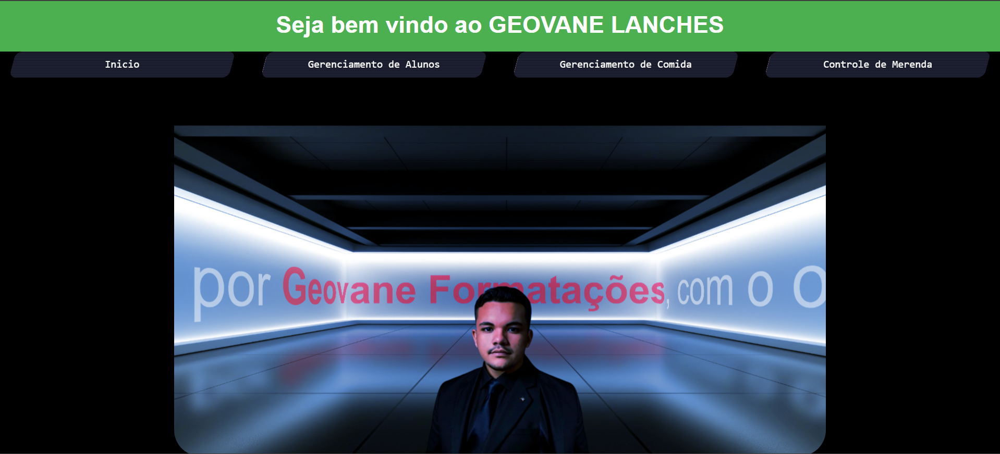

# **Projeto Merenda Escolar - Gestão de Alunos e Merendas**

Este projeto é uma aplicação web desenvolvida para gerenciar as informações de alunos, merendas escolares e o histórico de merendas. O sistema permite o cadastro, edição, exclusão e visualização de alunos e suas respectivas merendas. A aplicação também oferece um controle completo sobre o processo de distribuição das merendas, incluindo o gerenciamento do histórico de quem merendou ou não em determinados dias.

## **Tecnologias Utilizadas**

- **Frontend**:
  - **HTML**: Estruturação das páginas e elementos do site.
  - **CSS**: Estilo e layout da aplicação.
  - **JavaScript**: Funcionalidades interativas, como a navegação nas telas e integração com a API.
  
- **Backend**:
  - **Java (com Spring Framework)**: Usado para criar a API que gerencia os dados de alunos, merendas e histórico de merenda.
  - **PostgreSQL**: Banco de dados utilizado para armazenar informações sobre alunos, merendas e histórico de merenda. A API cria o banco de dados e as tabelas automaticamente.

- **Ferramentas de Desenvolvimento**:
  - **IntelliJ IDEA**: Ambiente de desenvolvimento usado para criar a API backend com Spring.
  - **PgAdmin**: Utilizado para gerenciar o banco de dados PostgreSQL.

## **Funcionalidades**

### **Tela de Início**

- Exibição da tela inicial com links de navegação para as outras funcionalidades do sistema.

### **Gestão de Alunos**

- **Cadastro de Alunos**: Permite adicionar novos alunos ao sistema, com informações como nome, idade, turma, etc.
- **Edição de Alunos**: Permite editar os dados dos alunos cadastrados.
- **Exclusão de Alunos**: Permite excluir alunos do sistema.
- **Busca de Alunos**: Permite realizar buscas rápidas pelos alunos cadastrados.
- **Visualização da Lista de Alunos**: Exibe a lista completa de alunos, com informações detalhadas.

### **Gestão de Merendas**

- **Cadastro de Merendas**: Permite adicionar novos tipos de merendas.
- **Edição de Merendas**: Permite editar os tipos de merendas cadastrados.
- **Exclusão de Merendas**: Permite excluir merendas do sistema.
- **Visualização da Lista de Merendas**: Exibe a lista completa de merendas cadastradas.

### **Controle de Merenda**

- **Início da Merenda**: Permite dar início ao registro de merenda (manhã, tarde e noite).
- **Escolha de Alunos**: Seleciona quais alunos consumiram a merenda e quais não consumiram.
- **Histórico de Merendas**: Permite visualizar o histórico de quem merendou ou não merendou em dias específicos, com base na interação com o calendário.

### **Tela de Histórico**

- **Calendário Interativo**: Permite selecionar um dia específico e visualizar quem merendou ou não naquele dia, com base no histórico armazenado.

## **Estrutura do Projeto**

**/ProjetoMerenda**
│
├── /backend
│   └── API Spring (IntelliJ IDEA)
│       └── /controllers
│       └── /models
│       └── /services
│       └── /repositories
│       └── /config
│
├── /frontend
│   └── index.html
│   └── /css
│       └── style.css
│   └── /js
│       └── script.js
│   └── /images
│       └── default-image.png
│
├── /database
│   └── schema.sql
│
└── README.md

## **Instalação e Execução**

### **Pré-requisitos**

1. **PostgreSQL** (instalado e configurado).
2. **Java** (versão 11 ou superior).
3. **IntelliJ IDEA** (para rodar a API Spring).
4. **PgAdmin** (para gerenciar o banco de dados).

### **1. Configuração do Banco de Dados**

1. **Banco de Dados PostgreSQL**: O banco de dados e as tabelas são criados automaticamente pela API. Quando você executar a API pela primeira vez, ela se conectará ao PostgreSQL e criará o banco de dados necessário, com as tabelas de alunos, merendas e histórico de merendas.

### **2. Executando a API**

1. Abra o projeto no **IntelliJ IDEA**.
2. Execute a aplicação Java com Spring Boot para iniciar a API.
3. A API estará disponível em `http://localhost:8080/` por padrão.

### **3. Executando o Frontend**

1. Abra o projeto no **Visual Studio Code**.
2. Abra o arquivo `index.html` no navegador.
3. O frontend se conectará automaticamente à API para realizar operações como cadastro de alunos, merendas e controle de merenda.

### **4. Testando a Aplicação**

- **Gestão de Alunos**: Cadastrar, editar, excluir e buscar alunos diretamente através da interface.
- **Gestão de Merendas**: Cadastrar, editar, excluir e visualizar merendas.
- **Controle de Merenda**: Registre quando os alunos merendaram e visualize o histórico com base no calendário.

## **Desenvolvedor**

Este projeto foi desenvolvido por **Geovane Formatações**. Se você tiver alguma dúvida ou sugestão, entre em contato!